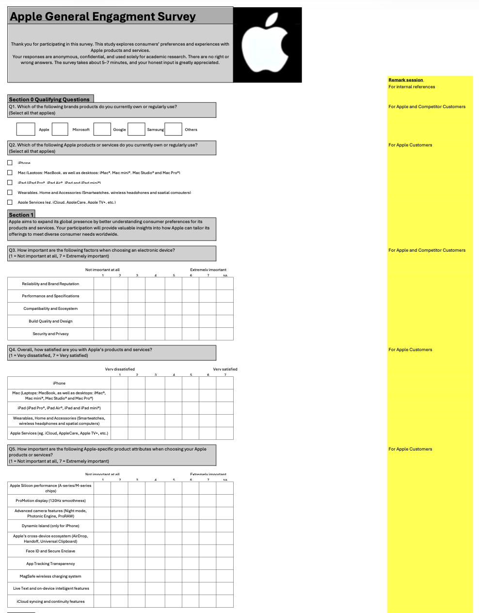
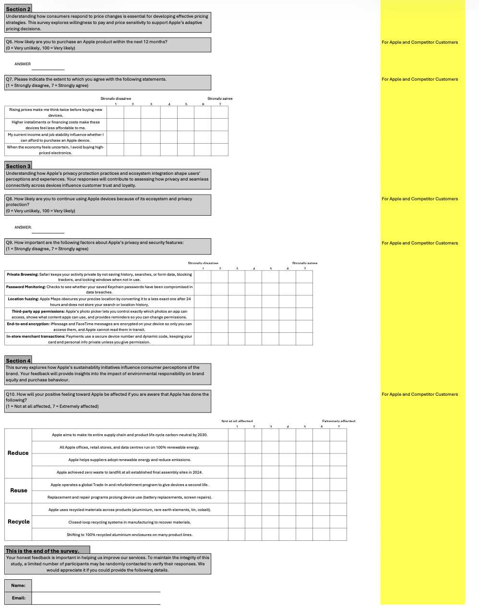

# 📋 Consumer Behaviour & Market Research Analysis

## Overview

Developed a comprehensive market research proposal to investigate consumer purchasing behaviour, pricing perceptions and sustainability preferences, providing strategic recommendations supported by statistical analysis.

---

## 🎯 Project Objectives

- Investigate consumer purchasing behaviour
- Understand pricing perceptions
- Assess sustainability preferences
- Recommend strategies to improve customer engagement

---

## 🛠 Technologies Used

- Microsoft Excel
- Statistical Analysis

---

## 🔍 Methodology

- Literature Review
- Research Proposal
- Survey Design
- Sampling Strategy
- Statistical Analysis Planning

---

## 📈 Statistical Techniques

- Factor Analysis
- Cluster Analysis
- Multiple Linear Regression
- One-Way ANOVA
- Independent Samples t-test

---
## Survey Instrument

A comprehensive questionnaire was designed and distributed to collect primary data from consumers. The survey was structured to support hypothesis testing and statistical modelling of the factors influencing Apple product purchasing behaviour.

## 📸 Survey Design

### Apple Consumer Behaviour Survey

Designed and developed a structured consumer behaviour questionnaire to investigate the factors influencing Apple product preferences, purchasing intentions, pricing sensitivity, privacy perceptions and sustainability awareness.

---

### Survey Structure

Organised the survey into four research themes covering product preferences, price sensitivity, ecosystem and privacy, and sustainability to support subsequent statistical analysis and hypothesis testing.

---

## 📊 Key Results

- Designed a structured market research framework to investigate consumer behaviour.
- Selected appropriate statistical techniques to evaluate customer preferences and purchasing decisions.
- Developed business recommendations to support pricing strategy, customer retention and product positioning.

---

## 💡 Skills Demonstrated

- Market Research
- Consumer Behaviour Analysis
- Statistical Analysis
- Business Recommendations
- Research Methodology
- Data Interpretation

---

## 🌱 What I Learned

This project strengthened my understanding of how statistical analysis supports business strategy beyond numerical results. I learned how to design research that aligns with business objectives, select appropriate analytical methods and translate consumer insights into practical recommendations for decision-makers.

---

## 📂 Project Files

📄 [Project Report](Consumer-Behaviour-Report.pdf)

📑 [Survey Questionnaire](Survey-Questionnaire.pdf)

