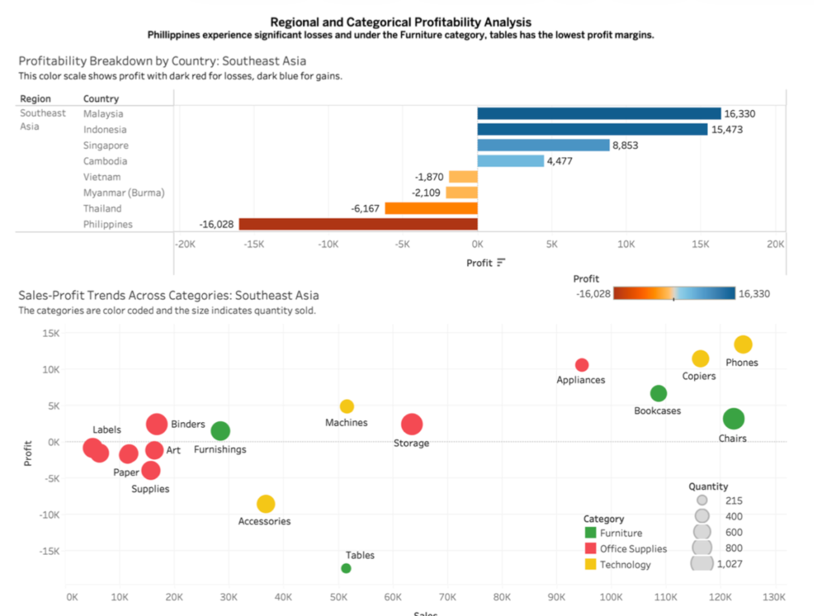
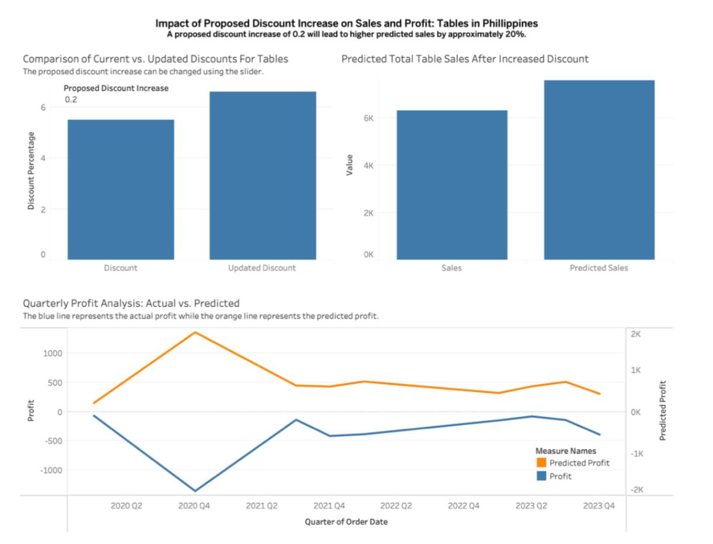

# 📊 Interactive Business Intelligence Dashboard

## Overview

Designed and developed interactive Tableau dashboards to analyse sales performance, profitability and pricing strategies of a superstore. The dashboards enable users to explore business performance through interactive visualisations and support data-driven decision-making.

---

## 🎯 Project Objectives

- Monitor sales and profitability of products
- Analyse regional and product performance
- Evaluate pricing and discount strategies
- Present business insights through interactive dashboards

---

## 🛠 Technologies Used

- Tableau
- Microsoft Excel

---

## 🔍 Methodology

- Data Preparation
- Dashboard Design
- KPI Development
- Calculated Fields
- Parameters
- Interactive Filters
- Dashboard Actions

---

## 📈 Key Results

- Developed 15 worksheets and 6 interactive dashboards.
- Designed KPI dashboards to monitor sales, profitability and regional performance.
- Built interactive visualisations that allow users to explore pricing scenarios and business performance dynamically.

---

## 📊 Dashboard Preview

*(Insert dashboard screenshots.)*

---

## 💡 Skills Demonstrated

- Tableau
- Dashboard Development
- Business Intelligence
- KPI Reporting
- Data Visualisation
- Interactive Dashboard Design
- Business Storytelling

---

## 🌱 What I Learned

This project taught me that effective dashboards are about more than attractive visualisations. I learned how to organise information, prioritise key metrics and design dashboards that allow users to quickly identify trends, investigate performance and support business decision-making through interactive exploration.

---

## 📂 Project Files

📄 [Project Report](Tableau-Report.pdf)

📊 [Dashboard PDF](Tableau-Dashboard.pdf)

📈 [Tableau Workbook](Dashboard.twbx)

## 📊 Dashboard Preview

### Overall Dashboard
*Monitors sales performance and profitability across different product categories and regions.*

---

### Regional Analysis
*Compares regional sales and profitability to identify high- and low-performing countries.*

---

### Categorical Analysis
*Provides an overview of sales performance, discount distribution and profitability across product categories to identify trends and support pricing decisions.*

---

### Shipping Mode Trends
*Evaluates shipping methods and their impact on sales and profit.*

---

### Impact of Proposed Discount
*Shows how proposed discount strategies influence sales and profitability.*

