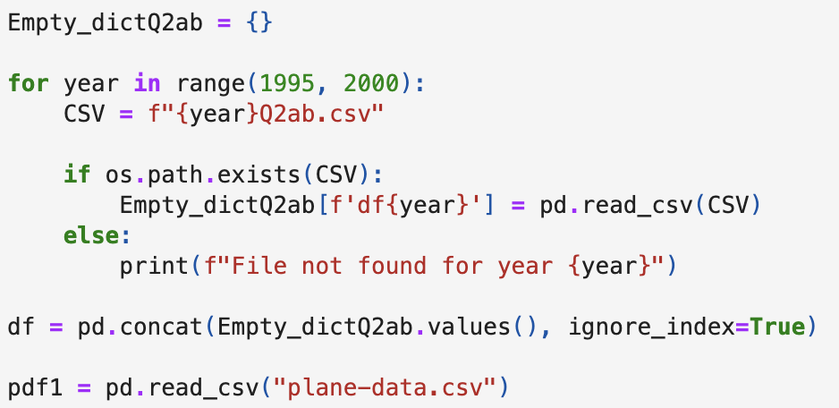
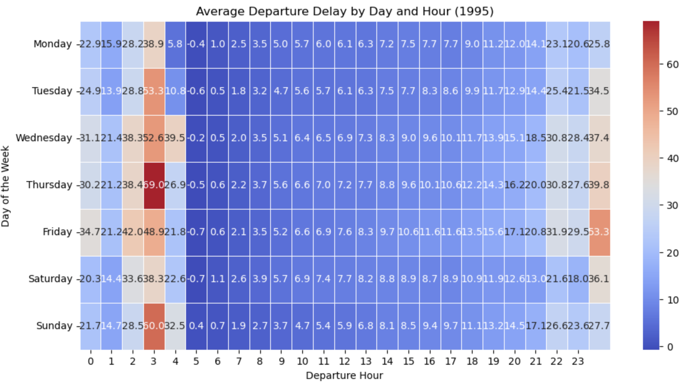
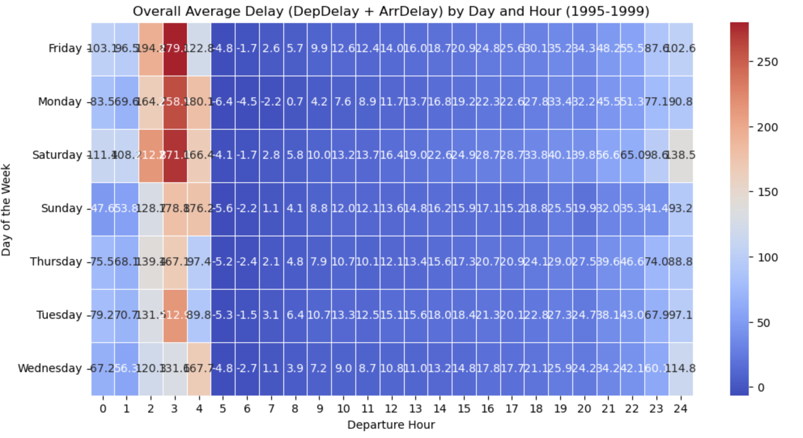
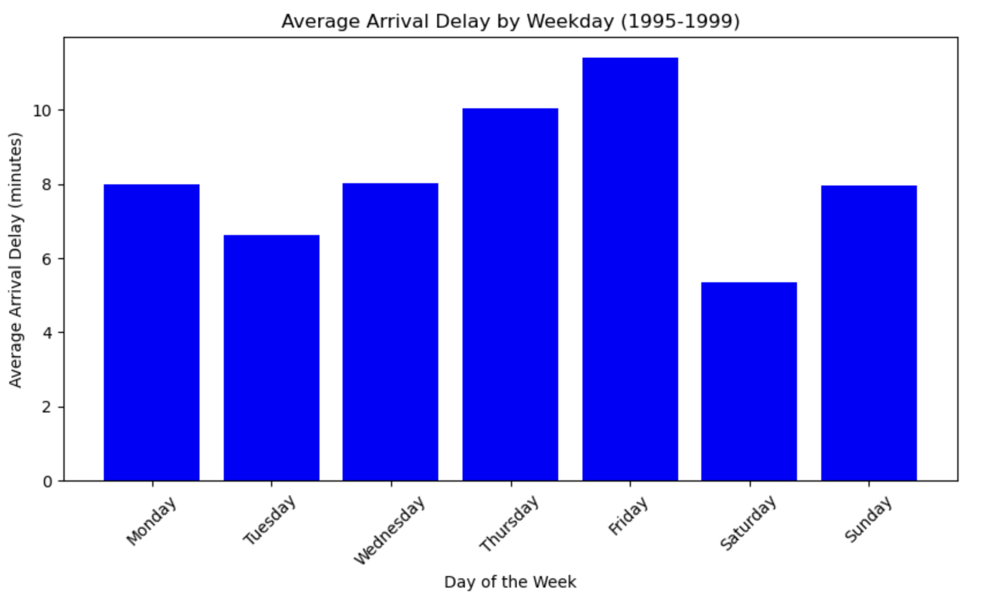
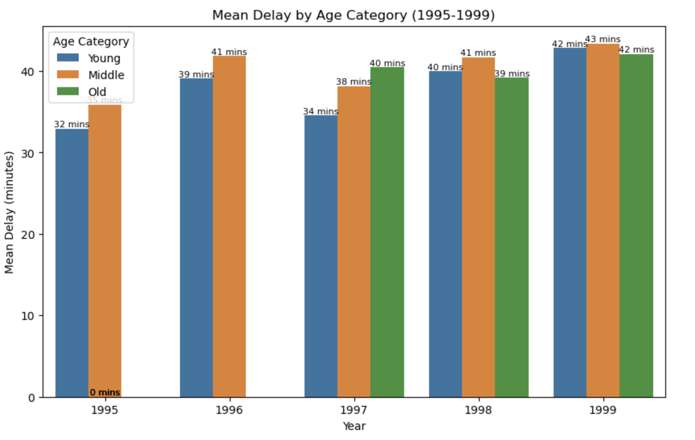
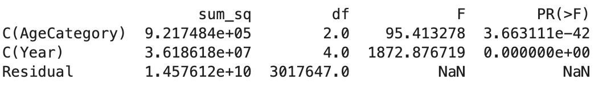
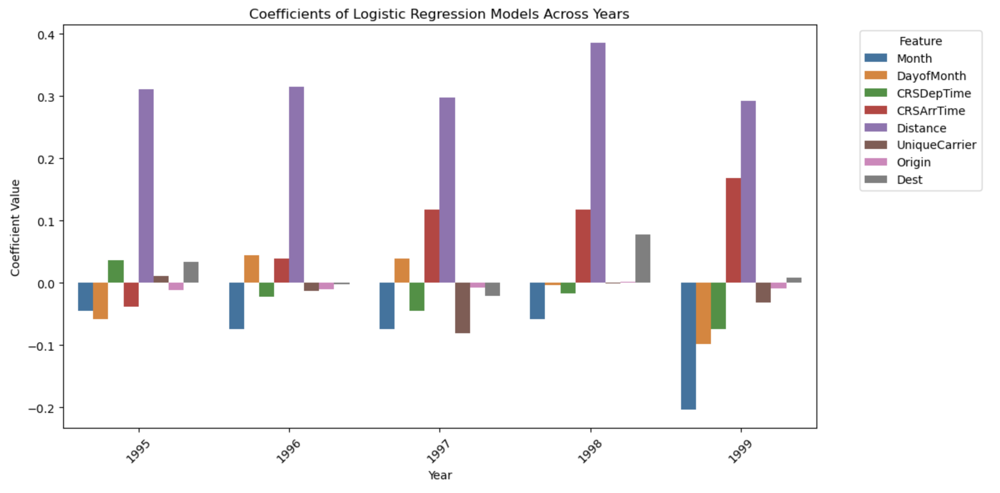

# 📈 Flight Delay Data Analysis & Business Insights

## Overview

Conducted exploratory data analysis on the U.S. Flight Delay dataset using Python, R and SQL. The project involved preparing raw aviation datasets, performing data transformation and generating business insights to better understand factors contributing to flight delays.

---

### Flight Delay Analysis Objectives

- Investigated delay patterns across airlines, airports and time periods
- Analysed temporal trends using date and time features
- Explored relationships between operational factors and flight delays
- Visualised key trends to support operational insights

---

## 🛠 Technologies Used

### Languages
- Python
- R
- SQL

### Python Imports
- pandas
- NumPy
- matplotlib
- seaborn
- os
- statsmodels.formula.api 
- statsmodels.api

### R Libraries
- tidyverse
- lubridate
- caret
- glmnet

### SQL Concepts Applied

- SELECT
- WHERE
- ORDER BY
- GROUP BY
- INNER JOIN
- Aggregate Functions (`COUNT`, `SUM`, `AVG`)

---

## 🔍 Methodology

### Data Preparation

- Converted raw **BV2** flight data files into standard CSV format for analysis.
- Cleaned, transformed and validated flight datasets before importing them into Python and R.
- Integrated multiple flight datasets to create a consistent dataset for analysis.

### Data Analysis

- Exploratory Data Analysis (EDA)
- SQL Queries
- Statistical Analysis
- Data Visualisation
- Trend Analysis

---
## 📸 Project Highlights

Pictures used are from Python.

### 🧹 Data Preprocessing & Integration

#### Data Cleaning Workflow

Preprocessed and consolidated five years (1995–1999) of flight delay data by cleaning missing values, selecting relevant features, and combining multiple yearly datasets into a single analysis-ready dataset.

---

## ✈️ Flight Delay Analysis
Pictures used are from Python.
#### Flight Delay Heatmap

Visualised average departure and arrival delays by hour and weekday using heatmaps to identify temporal delay patterns. Only one example was shown.

---

#### Average Delay by Time of Day

Identified early morning departures (approximately 4:30–5:30 AM) as the period with the lowest average flight delays across the five-year dataset. 

---

#### Average Delay by Weekday

Compared average delays across weekdays and found Saturday consistently experienced the lowest overall delays. 

---

## 🛫 Aircraft Age Analysis

#### Delay by Aircraft Age Category

Compared flight delays across aircraft age groups to investigate whether older aircraft experience greater operational delays. 

---

#### Two-Way ANOVA Results

Applied Two-Way ANOVA to evaluate the effects of aircraft age and year on flight delays, confirming both factors significantly influence delay patterns. 

---

## 🤖 Logistic Regression

#### Feature Coefficients by Year

Trained yearly logistic regression models to predict flight diversions and analysed feature coefficients to understand how predictor importance evolved over time. 

---

## 📈 Key Results

- Prepared raw flight delay datasets by converting proprietary BV2 files into analysis-ready CSV files.
- Identified operational trends and contributing factors associated with flight delays through exploratory data analysis.
- Produced statistical summaries and visualisations to communicate findings and support business recommendations.

---

## 💡 Skills Demonstrated

- Data Cleaning
- Data Transformation
- Data Integration
- SQL
- Python
- R
- Exploratory Data Analysis
- Statistical Analysis
- Business Insights

---

## 🌱 What I Learned

This project highlighted that effective analysis begins with well-prepared data. Working with raw flight delay datasets taught me the importance of data transformation, cleaning and validation before performing analysis. I also gained experience using Python, R and SQL together to investigate operational performance and communicate meaningful insights through visualisations and statistical analysis.

---

## 📂 Project Files

[📄 Project Report](Data-Analysis-Report.pdf)

[💻 Python Script](Python-Qn2.ipynb)

[📈 R Script](R-Qn2.Rmd)
