# 🧠 Machine Learning & Predictive Analytics

## Overview

Applied supervised and unsupervised machine learning techniques across three real-world datasets to solve clustering, regression and classification problems. This project demonstrates the complete machine learning workflow, from data preprocessing and feature engineering to model evaluation and interpretation.

---

## 🎯 Project Objectives

- Discover hidden patterns using unsupervised learning
- Build predictive regression models for house price estimation
- Develop classification models for lung cancer prediction
- Compare model performance using appropriate evaluation metrics

---

## 🛠 Technologies Used

- R -
dplyr,
ggplot2,
caret,
randomForest,
xgboost,
cluster,
tidyverse

---

## 🔍 Methodology

### Wine Quality Dataset
- Principal Component Analysis (PCA)
- K-Means Clustering
- Hierarchical Clustering
- Cluster Evaluation (Elbow Method & Silhouette Analysis)

### House Price Dataset
- Data Cleaning & Feature Engineering
- Regression Modelling
- Hyperparameter Tuning
- Model Evaluation

### Lung Cancer Dataset
- Data Preprocessing
- Classification Modelling
- Performance Comparison using Accuracy, F1-score and ROC AUC

---

## 📈 Key Results

- Applied unsupervised learning to identify natural groupings within wine quality data.
- Developed regression models capable of predicting housing prices using multiple predictive features.
- Compared several classification models to identify the most effective approach for lung cancer prediction.

---

## 📸 Project Highlights

### 🍷 Unsupervised Learning (Wine Dataset)

#### Principal Component Analysis (PCA)

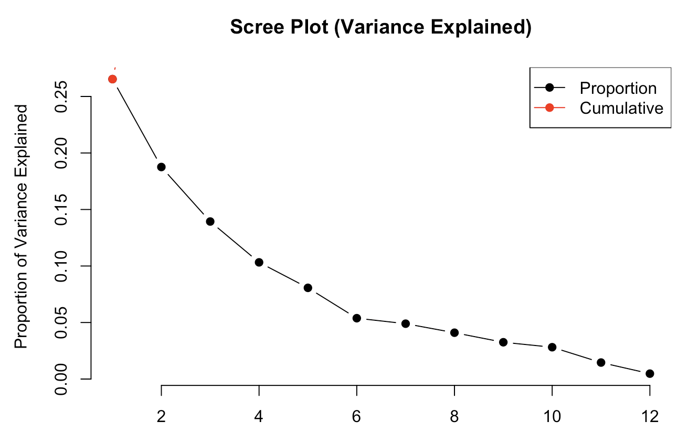

Reduced feature dimensionality using Principal Component Analysis (PCA) to preserve data structure and support clustering.

---

#### K-Means Clustering

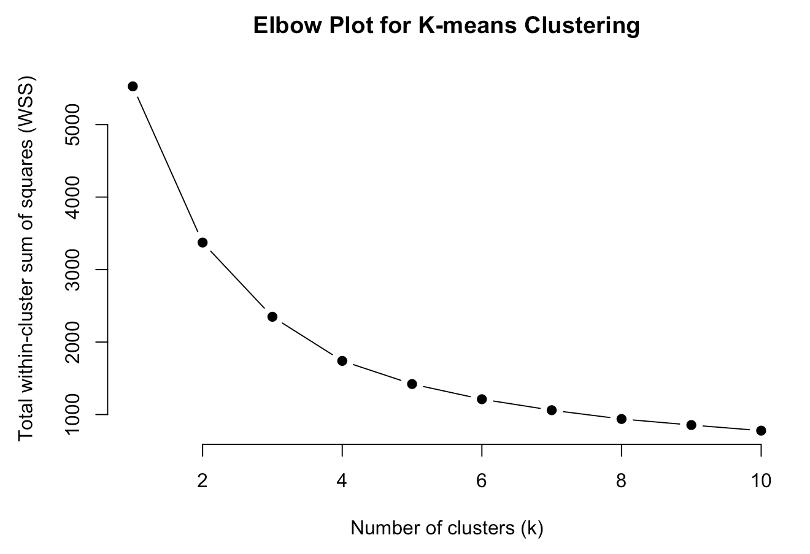

Applied K-Means clustering to identify distinct groups of wines based on their physicochemical characteristics.

---

#### Silhouette Analysis

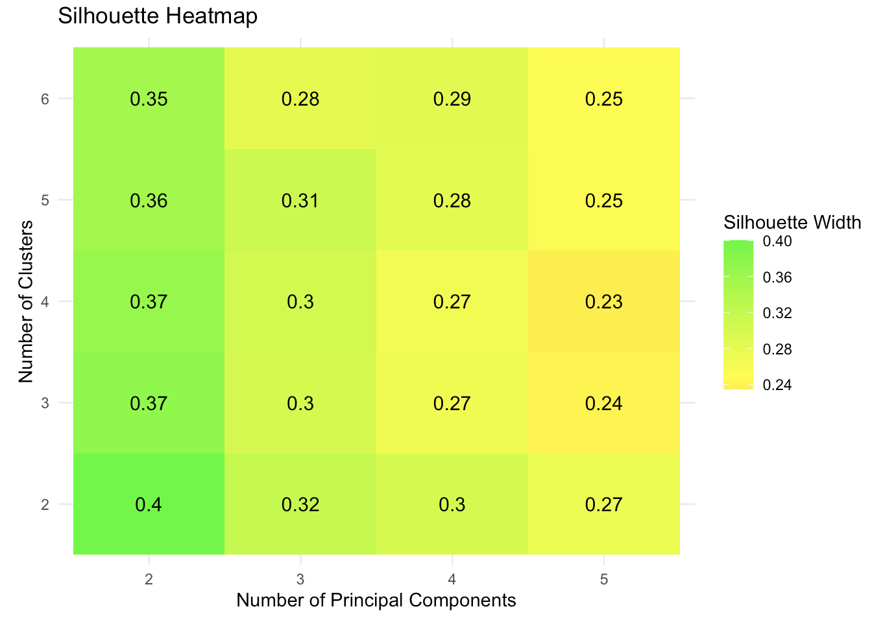

Evaluated clustering quality using Silhouette Analysis to determine the optimal number of clusters.

---

#### Hierarchical Clustering

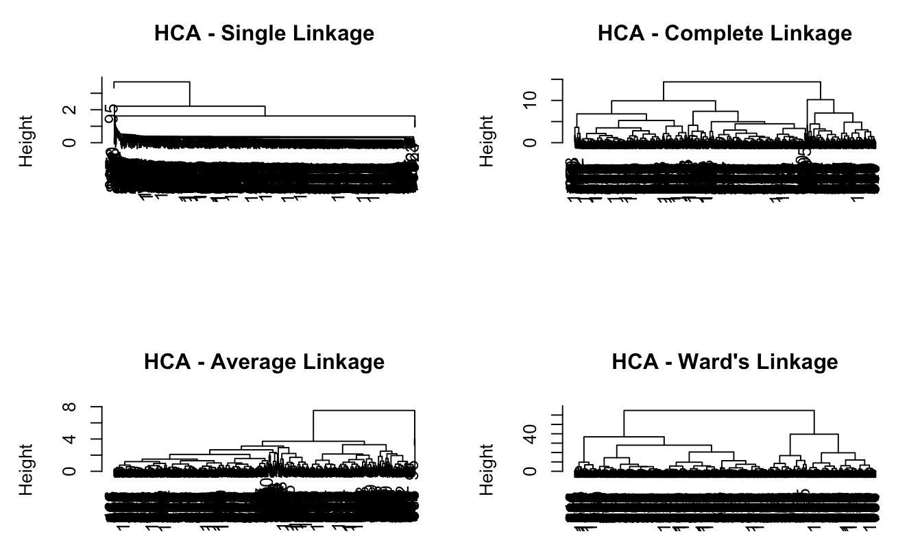

Performed Hierarchical Cluster Analysis (HCA) to compare clustering structures and validate grouping patterns.

---

## 🏠 Regression Analysis (House Price Dataset)

#### Stepwise Regression

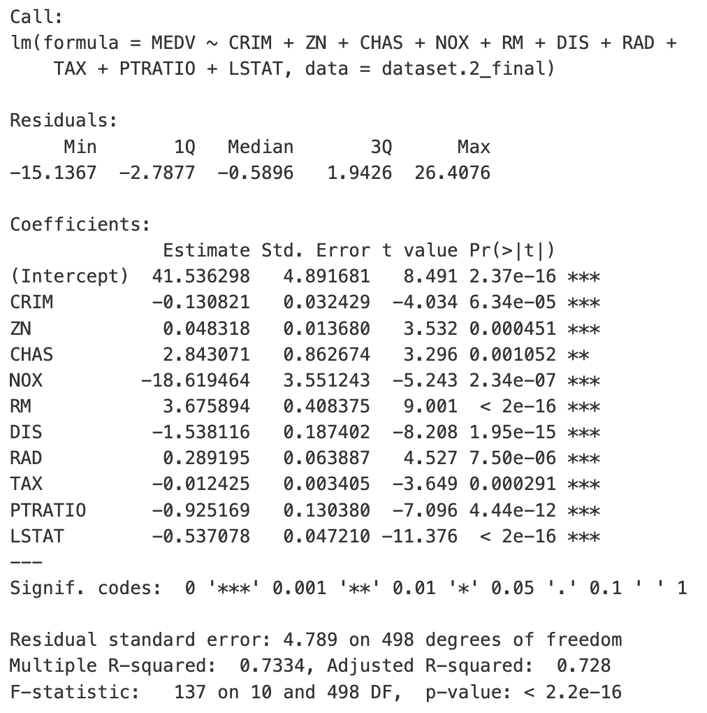

Applied stepwise regression to identify the most significant predictors influencing house prices.

---

#### Feature Importance

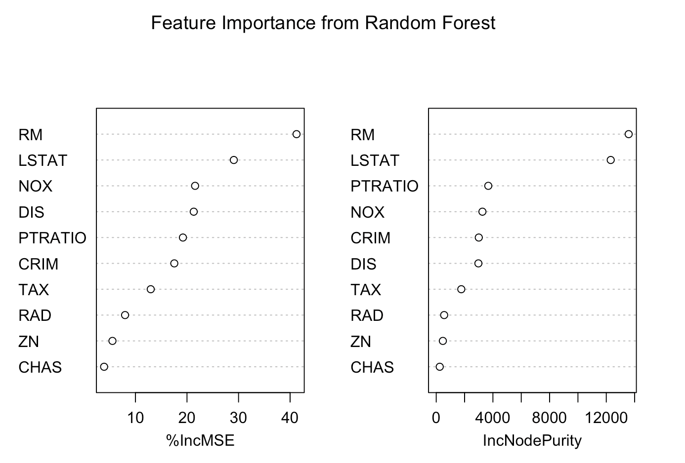

Identified the most influential variables contributing to house price predictions through feature importance analysis.

---

#### Model Comparison

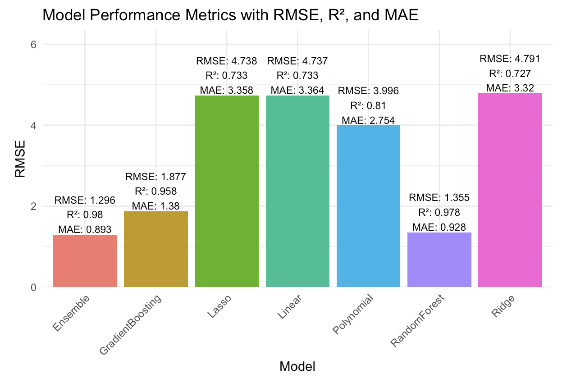

Compared multiple regression models using evaluation metrics such as RMSE and R² to determine the best-performing predictive model.

---

## 🫁 Classification (Lung Cancer Dataset)

#### Confusion Matrix

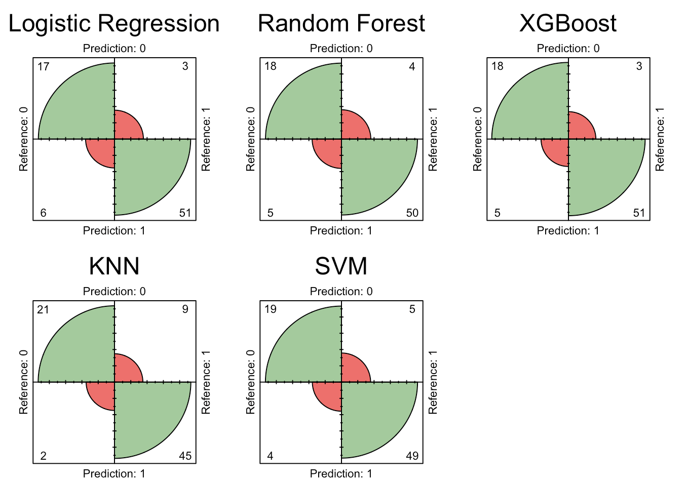

Evaluated classification performance using a confusion matrix to assess prediction accuracy across different outcome classes.

---

#### ROC Curve

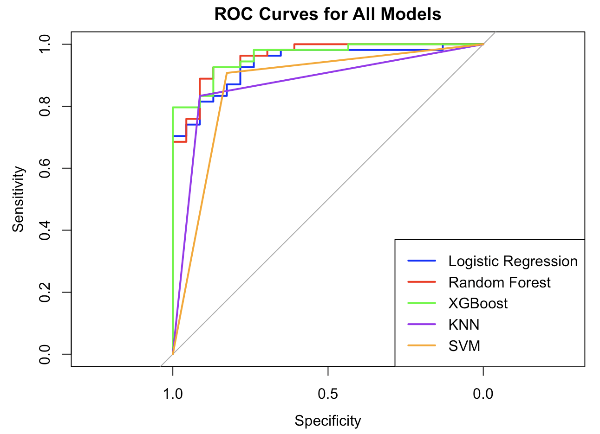

Compared classification models using ROC curves and AUC scores to evaluate their predictive performance.

---

#### Feature Importance

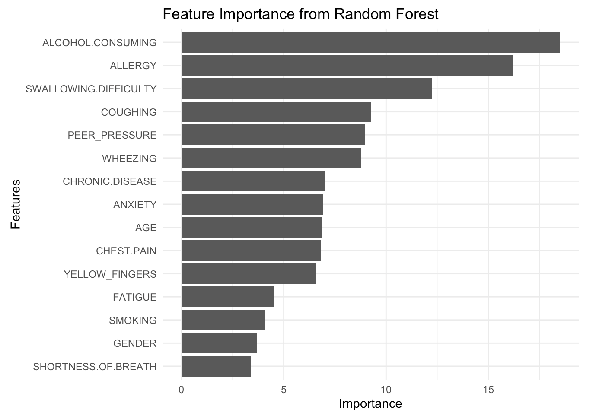

Ranked predictor importance to identify the variables with the greatest influence on lung cancer prediction.

---

#### Final Model Comparison

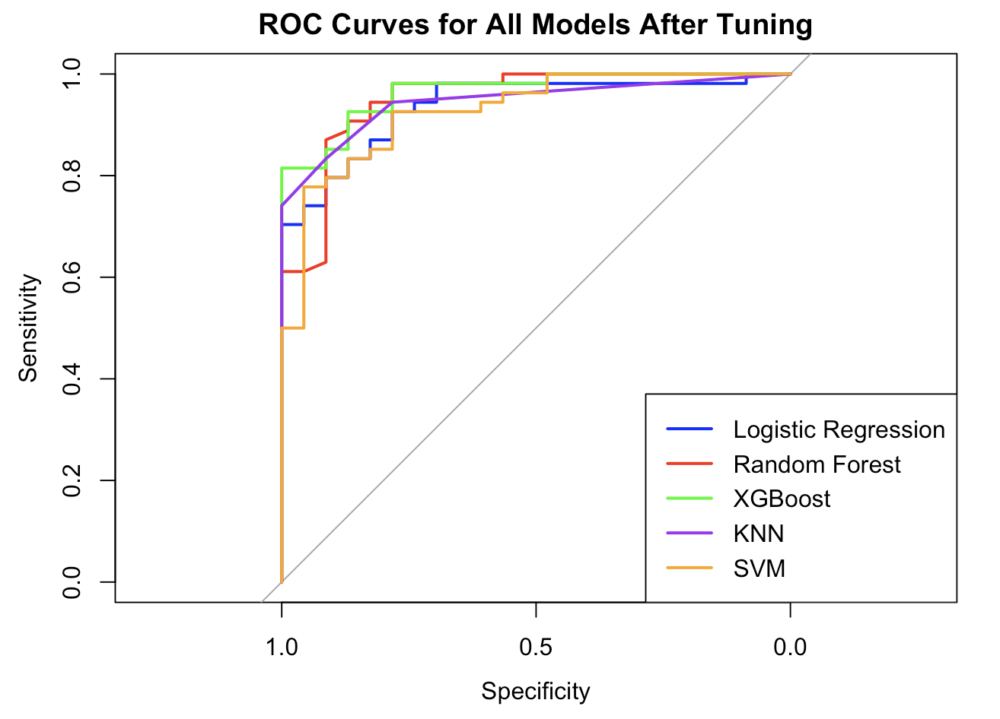

Compared multiple classification models to identify the most accurate and reliable approach for lung cancer prediction.

---

## 💡 Skills Demonstrated

- Machine Learning
- Data Preprocessing
- Feature Engineering
- Regression
- Classification
- Clustering
- Model Evaluation
- Statistical Analysis
- R

---

## 🌱 What I Learned

This project strengthened my understanding of the complete machine learning lifecycle, from preparing raw data to selecting and evaluating predictive models. Working across three different problem types taught me that choosing an appropriate analytical approach depends on both the business objective and the characteristics of the dataset, rather than applying a single model to every problem.

---

## 📂 Project Files

[📄 Machine Learning Report](Machine-Learning-Report.pdf)

[📈 R Script](Machine-Learning-Script.Rmd)

📁 Datasets

These are publicly available datasets.
- **Wine Quality Dataset** :https://www.kaggle.com/datasets/yasserh/wine-quality-dataset
- **House Price Dataset** :https://www.kaggle.com/datasets/shubhammeshram579/house?resource=download
- **Lung Cancer Dataset** :https://www.kaggle.com/datasets/mysarahmadbhat/lung-cancer?resource=download
